# Get your Microsoft 365 devoloper tenant

## Register for a Microsoft account

1. Open a browser and navigate to: https://developer.microsoft.com/en-us/microsoft-365/dev-program

    You’ll see the following page:

    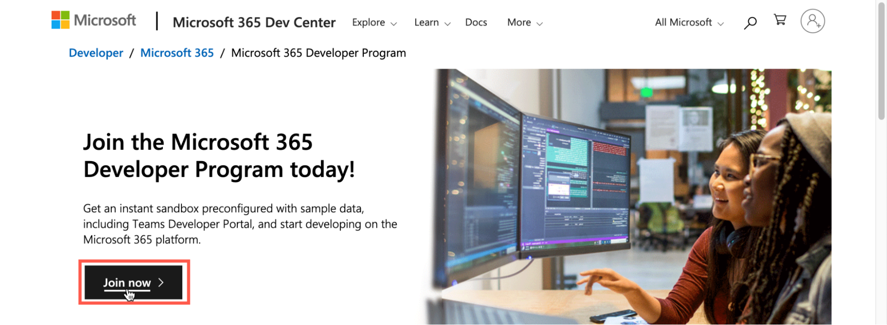

1. Click **Join now**.

    The login page is displayed:
    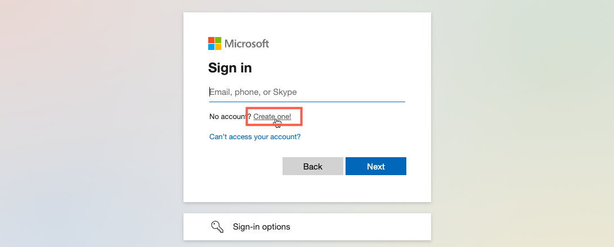

1. Click **Create one**.
   
    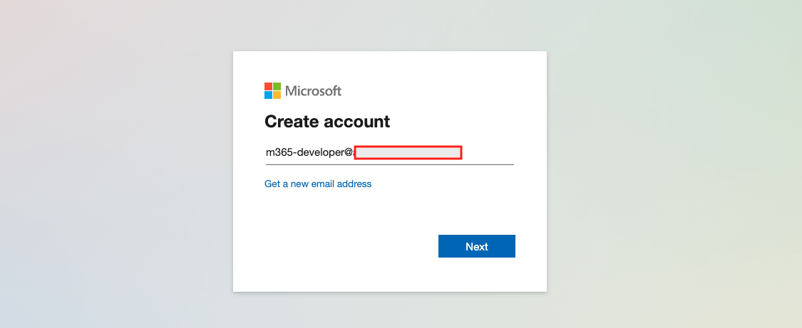

1. Enter the email address you want to associate with your developer account.

1. Click **Next**.
   
    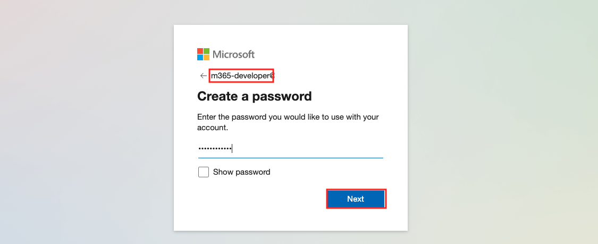

1. Create a password for your account and then click **Next**.

    

1. Set your *Country/region* and *Birthdate* then click **Next**.

   A validation code is sent to your email address and a challenge page is displayed:
   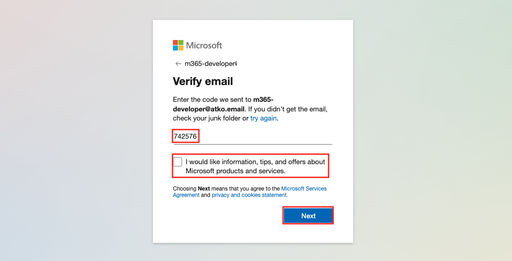

1. Retrieve the code sent to your email address and enter it on the verification page.

1. Clear the check-box so that you don’t get additional emails.

1. Click **Next**.

   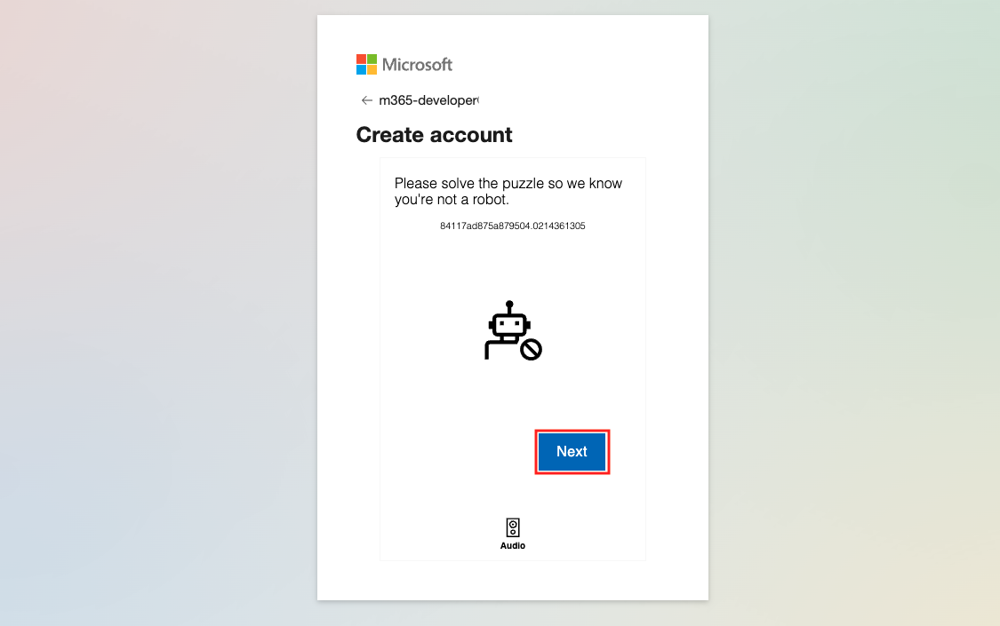

1. Click **Next** and complete the “I am not a robot” checks.

   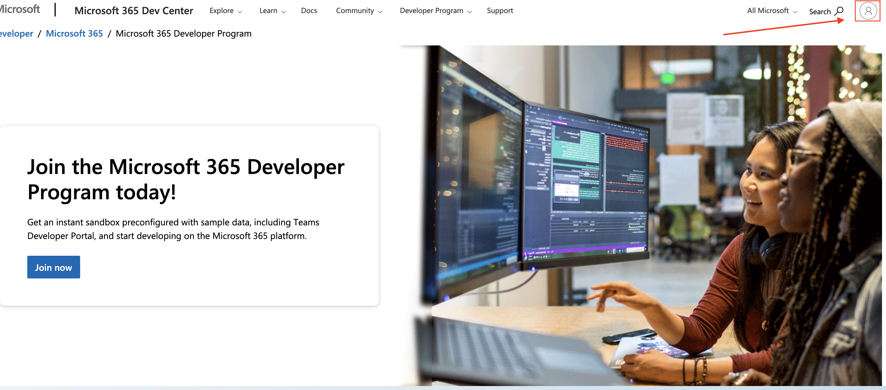

1. Click on the profile icon in the upper right corner and then click on **Add your name**

   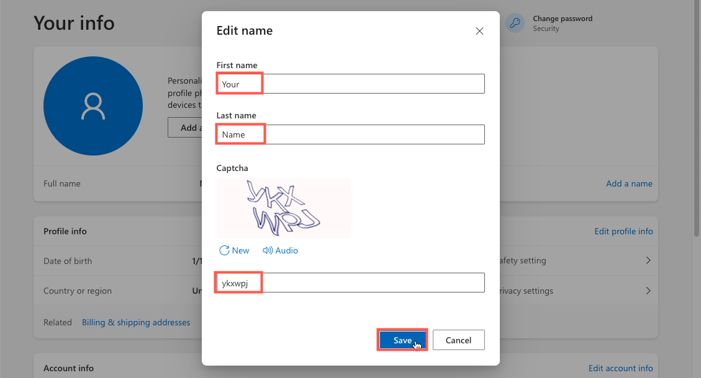

1. Enter your **First name** and **Last name**.

1. Complete the **Captcha** and click the **Save** button.

   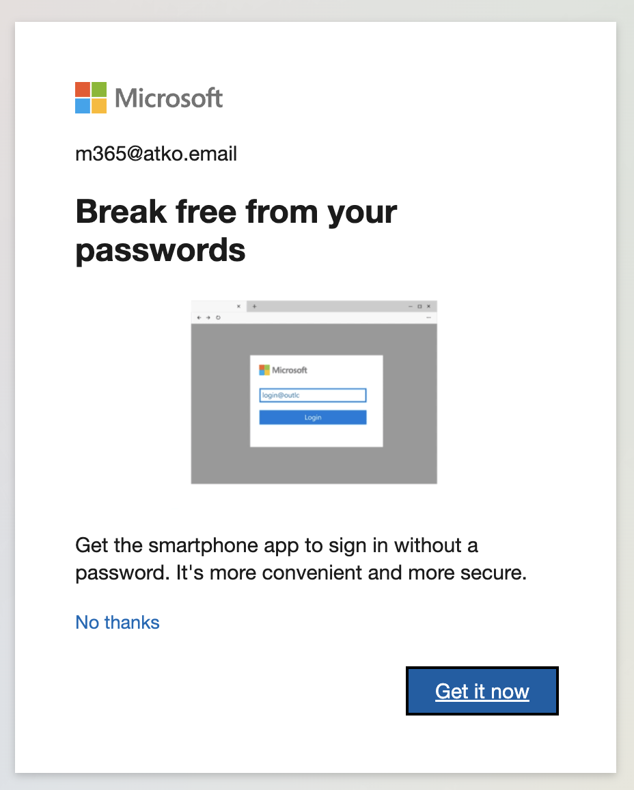

1. Add your phone number as an additional recovery method by clicking on **Get started**

   

1. Enter your **password** and **Sign in**

   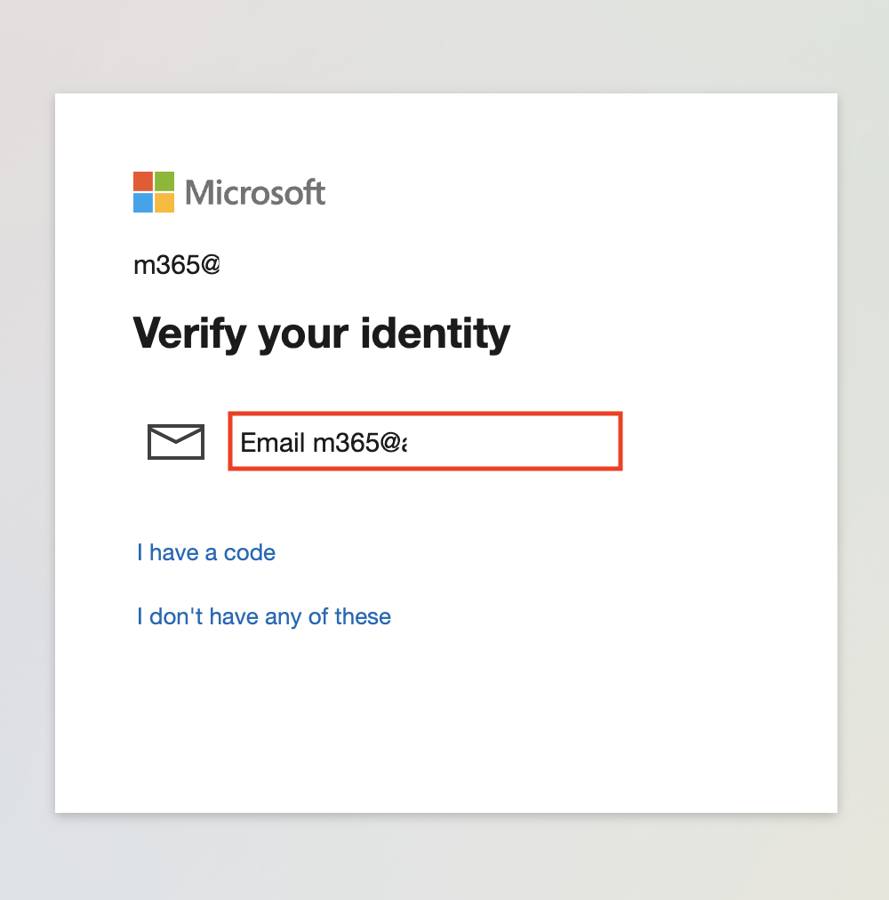

1. Verify your identity by clicking on **your eMail** in the middle.

   

1. Enter the **code** you received via eMail and click on **Verify**

   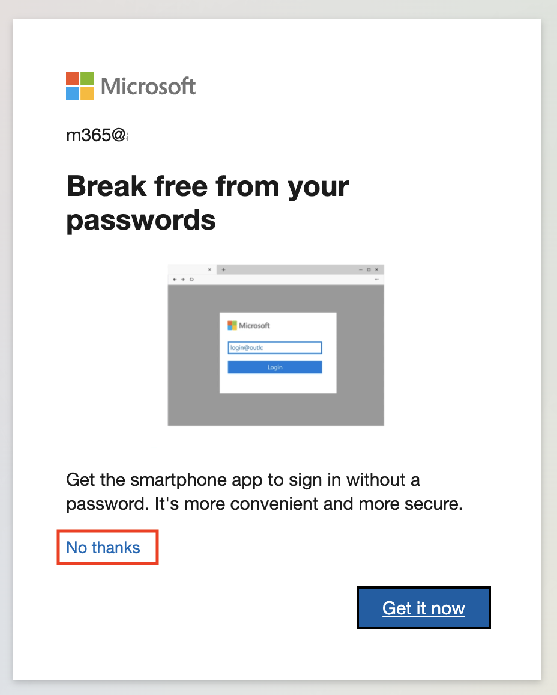

1. Click on **No thanks** to skip adding the M$ Authenticator

   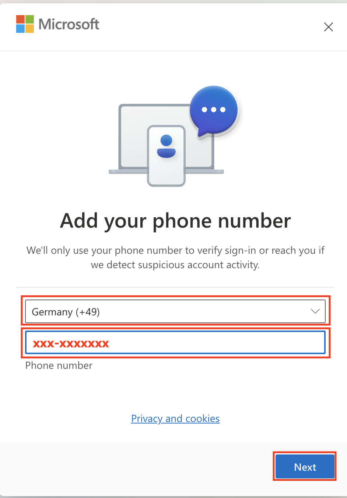

1. Enter your **country code** and **phone number** and click **Next**

   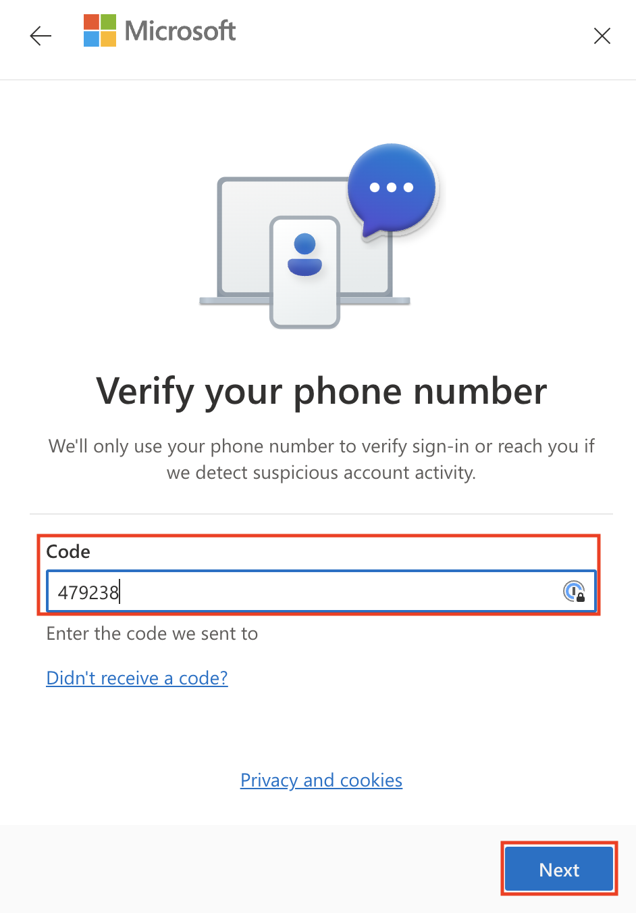

1. Verify your phone number by entering the **Code** you received via SMS and click on **Next**

   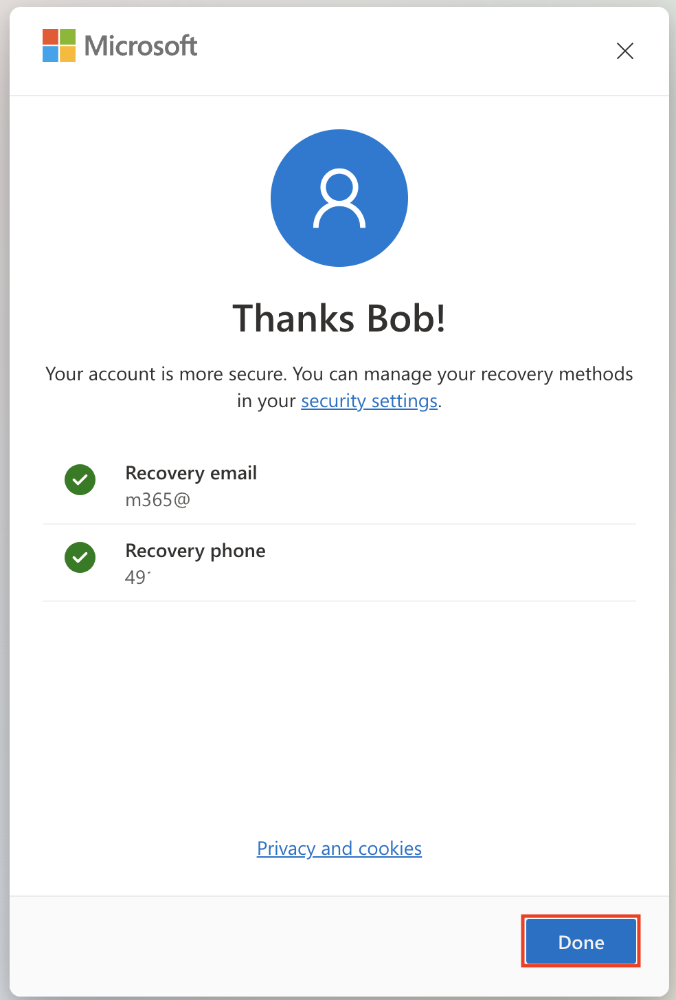

1. Check your recovery settings and click on **Done**
   
Congrats! Your account has now been created, and you completed your Microsoft profile. However, you will have to wait up to an hour for your additional profile data to propagate to the developer site so that you can join the developer program.
