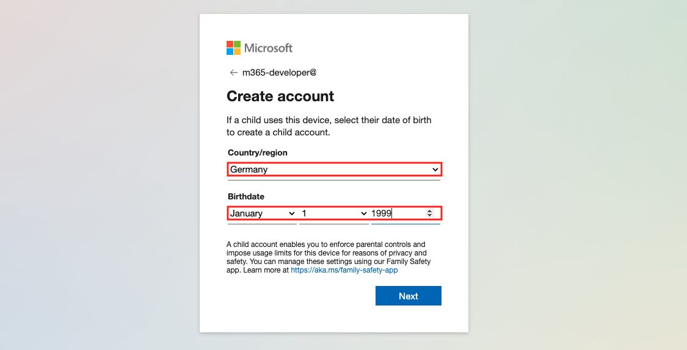
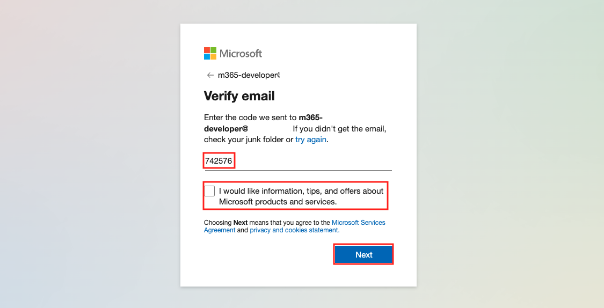
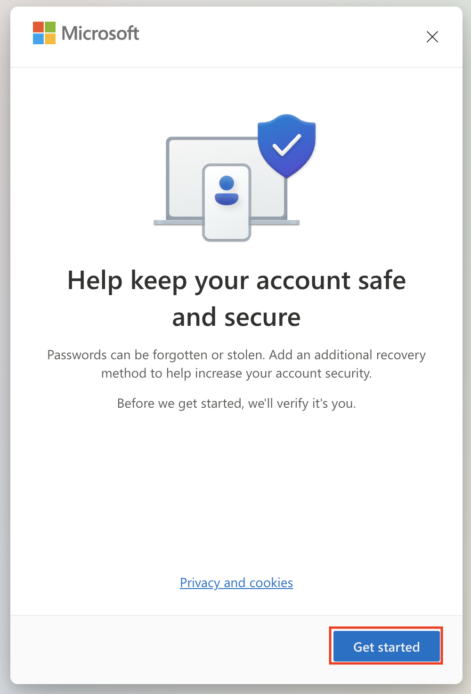

# Get your Microsoft 365 devoloper tenant

## Register for a Microsoft account

In this section you will register for a Microsoft account. If you already have an existing account you can skip this section but it is probably better to create a dedicated account for use with your Okta demo environment.

> Note: At the end of this section you will have to wait up to one hour for your profile data to propagate to the developer site.  Plan this into your day.

> Note: During this lab you will need to make a note for the following values:
>
> 1. Microsoft.Account.Username
> 2. Microsoft.Account.Password
> 3. Office365.Admin.Username
> 4. Office365.Admin.Password
> 5. Office365.Tenant.Name

1. Open a browser and navigate to: https://developer.microsoft.com/en-us/microsoft-365/dev-program

    You’ll see the following page:

    

1. Click **Join now**.

    The login page is displayed:
    

1. Click **Create one**.
   
    

1. Enter the email address you want to associate with your developer account.

1. Click **Next**.
   
    

1. Create a password for your account and then click **Next**.

    

1. Set your *Country/region* and *Birthdate* then click **Next**.

   A validation code is sent to your email address and a challenge page is displayed:
   

1. Retrieve the code sent to your email address and enter it on the verification page.

1. Clear the check-box so that you don’t get additional emails.

1. Click **Next**.

   

1. Click **Next** and complete the “I am not a robot” checks.

   

1. Click on the profile icon in the upper right corner and then click on **Add your name**

   

1. Enter your **First name** and **Last name**.

1. Complete the **Captcha** and click the **Save** button.

   

1. Add your phone number as an additional recovery method by clicking on **Get started**

   

1. Enter your **password** and **Sign in**

   

1. Verify your identity by clicking on **your eMail** in the middle.

   

1. Enter the **code** you received via eMail and click on **Verify**

   

1. Click on **No thanks** to skip adding the M$ Authenticator

   

1. Enter your **country code** and **phone number** and click **Next**

   

1. Verify your phone number by entering the **Code** you received via SMS and click on **Next**

   

1. Check your recovery settings and click on **Done**

> Note: Make a note of the credentials created above as:
> 
> 1. Microsoft.Account.Username
> 2. Microsoft.Account.Password
   
Congrats! Your account has now been created, and you completed your Microsoft profile. However, you will have to wait up to an hour for your additional profile data to propagate to the developer site so that you can join the developer program. Take a coffee before you jump to the next section to join the Microsoft developer program.

## Join the developer program

In this section you will join the Microsoft developer program.

1. Open a browser and navigate to: https://developer.microsoft.com/en-us/microsoft-365/dev-program

    You’ll see the following page:

    

1. Click **Join now**.

1. You should still be logged in (If not, login with the credentials you created in the previous section)

    

1.
    * Select your **Country/Region** and **Language** preference.
   
    * Enter **Okta** (or anything else) as your **Company**.
   
    * Check the checkbox to accept the terms and conditions
   
    * Clear the checkbox so you don’t get extra email.
   
    * Click **Next**.
  
    

1. Select a primary focus for your tenant and click **Next**.

    

1. Pick at least **one** development area, **confirm** that you are not a robot and click **Save**.

    

1. Select Configurable sandbox.
You need to pick this option so that you can customize the domain for your sandbox. Although the description says this can take two days to provision, it is usually much quicker (can even be immediate).

   Click **Next**

    

1.
    * Select the **Country/region** where your sandbox will be created.
      
    * Enter a **username** for your super admin user. This can be whatever you like.
  
    * Set the **domain** for your sandbox. 

    * Enter (and confirm) a password for your super admin user.
This password must be at least 15 characters so you might want to use a password manager and let it generate one.

    * Check the details and then click **Continue**.
  
    > Note: Make a note of the values created above as:
    > 
    > 1. Office365.Admin.Username
    > 1. Office365.Admin.Password
    > 1. Office365.Tenant.Name (this is the value that was entered under **create domain**)
  
    

1. Enter a phone number to validate your developer sandbox.

    > Note: You may see an error if you use a phone number that is already associated with a different Microsoft developer account. You’ll have to use a different phone number.

1. Click **Send Code**.
   
    The code is sent to your phone via SMS.

    

1. Enter the received code and click **Set up**.

    Your developer subscription is created.  While it is working you see this screen:
   
    

    On completion, you will see this:
   
    

   **Congrats** your Microsoft Office 365 developer sandbox is now ready to use.
