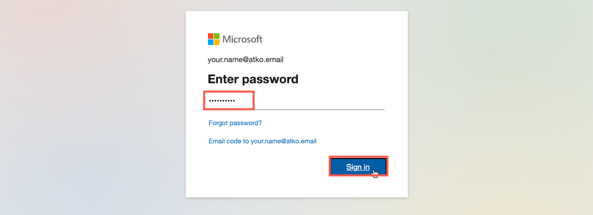
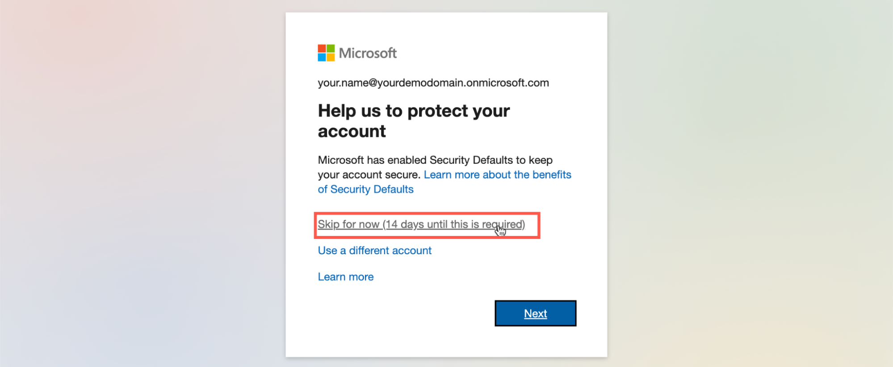
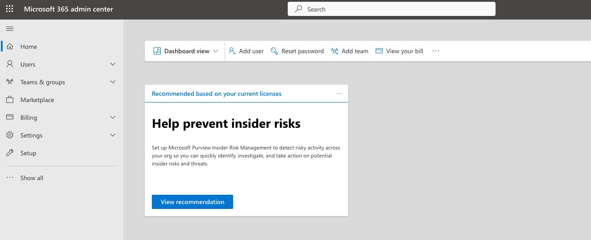
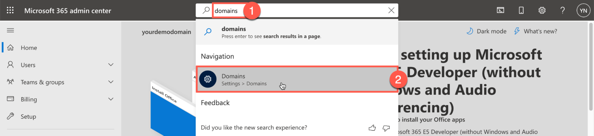

# Prepare your Microsoft Office 365 tenant

## Sign into your Microsoft Office 365 tenant

1. Log in to the portal at https://admin.microsoft.com

1. Click **Sign in**.

    

1. Enter your username. You’ll need to use the format below:

> Note: **username@your demo domain.onmicrosoft.com**

1. Click **Next**.

    

1. Enter password and click **Sign in**.

    

1. You may see this screen. If so, click **Skip for now**.

> Note: You don’t want to set up Multi-factor authentication in Microsoft because you’re going to enable it in Okta instead.  In the next section, there are instructions on disabling MFA in M365 which will prevent this from showing again.

   
   You are now signed into your M365 admin interface. 

## Disable native MFA

In your demonstration environment, you will connect your Okta tenant with this M365 tenant.  All access to M365 will be via Okta and Okta will be responsible for user authentication, registration of additional authentication factors, and enforcing Multi-Factor Authentication in line with configured authentication policy.
To stop M365 from ALSO trying to perform MFA registration, and enforce MFA at login, you need to disable Multi-Factor Authentication in the M365 Administration pages.

    

1. In the admin center, type ** 1. identity** into the search bar.

1. Select ** 2. Identity** from the results.

Click **Skip for now** if prompted to secure your account.
