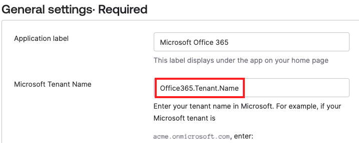
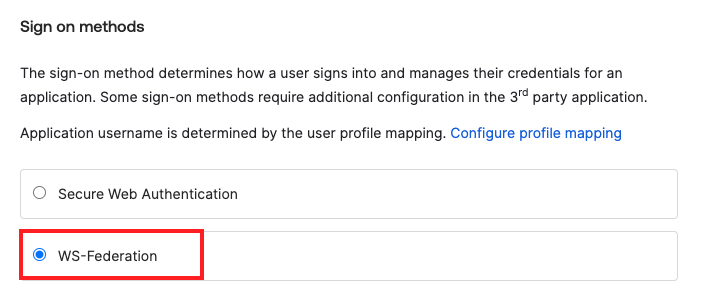
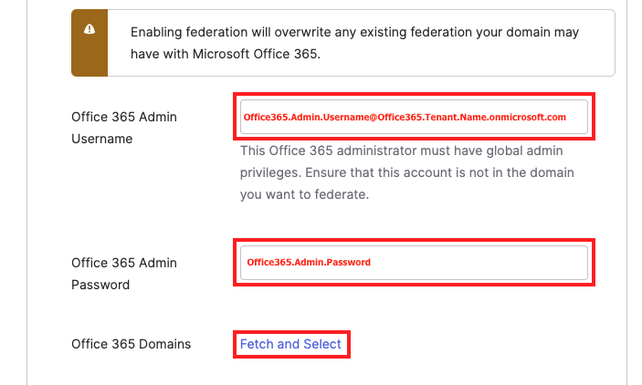
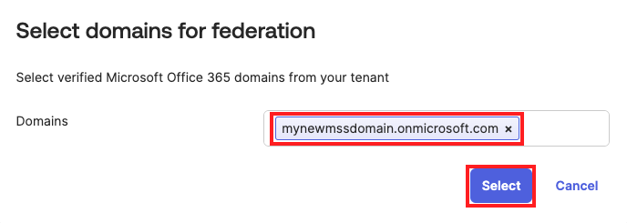
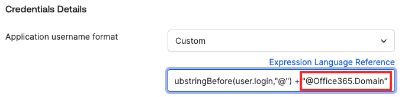

# Integrate Okta for Single-Sign-On and Lifecycle Management with your Microsoft Office 365 tenant

In this lab, we'll effortlessly integrate Okta with your Microsoft Office 365 environment. By leveraging the Okta Integration Network, you'll experience firsthand how modern application integrations can be both straightforward and rapid. Through the benefits of automated provisioning and single sign-on, employees will be poised for instant productivity. And even as we focus on a user-friendly experience, remember, security is always at the forefront.

## Add Microsoft Office 365 App to Okta for SSO

1. Log in to your Okta Admin Dashboard `{{idp.name}}-admin.okta.com`
1. In the Admin Dashboard select **Applications** >  **Applications**.
1. Click **Browse App Catalog**.
1. In the Browse App Integration Catalog **Search...** bar, type *office 365* and then click **Microsoft Office 365**.
1. Click **Add integration**.

### General Settings

1. In the **General Settings** tab, enter your **Office365.Tenant.Name**

    
1. Optional. For **Display the following links**, deselect all but: **Word Online, Excel Online, PowerPoint Online and Office Portal**.
1. Scroll down and click **Next**.

### Sign-On Options

1. In the **Sign On Options** tab, select **WS-Federation**.

    
   
1. Set the **Office 365 Admin Username** to `Office365.Admin.Username@Office365.Tenant.Name.onmicrosoft.com`
1. Set the **Office 365 Admin password** to `Office365.Admin.Password`
1. Click **Fetch and Select**. This will fetch a list of your Office 365 Domains.

    

10. Select the **Office365.Domain** domain, and then click **Select**.

    

### Customization with Okta Expression Language

1. In the **Credential Details** section, for **Application username format** select **Custom**.
1. For the **Custom** expression, copy and paste the following expression:

    ```javascript
    String.substringBefore(user.login,"@") + "@Office365.Domain"
    ```

    

4. Click **Done**.

Congratulations! Your Okta Workforce Identity Cloud and Office 365 tenant are now configured for single sign-on from Okta to Office 365.
