# Integrate Okta for Single-Sign-On and Lifecycle Management with your Microsoft Office 365 tenant

In this lab, we'll effortlessly integrate Okta with your Microsoft Office 365 environment. By leveraging the Okta Integration Network, you'll experience firsthand how modern application integrations can be both straightforward and rapid. Through the benefits of automated provisioning and single sign-on, employees will be poised for instant productivity. And even as we focus on a user-friendly experience, remember, security is always at the forefront.

> Note: Before you can start you must have successfully completed the previous labs

## Add Microsoft Office 365 App to Okta for SSO

1.  Log in to your Okta Admin Dashboard `{{idp.name}}-admin.okta.com`
1. In the Admin Dashboard select **Applications** >  **Applications**.
1. Click **Browse App Catalog**.
1. In the Browse App Integration Catalog **Search...** bar, type *office 365* and then click **Microsoft Office 365**.
1. Click **Add integration**.

### General Settings

1. In the **General Settings** tab, enter your **Microsoft Tenant Name**

    |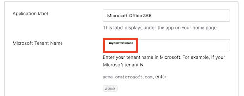|
1. Optional. For **Display the following links**, deselect all but: **Word Online, Excel Online, PowerPoint Online and Office Portal**.
1. Scroll down and click **Next**.

This guide provides instructions for integrating Okta with Microsoft
Office 365 so that the following use cases can be demonstrated:

-   Single Sign-on (SSO) from Okta to Microsoft Office 365

-   Lifecycle Management (LCM) for Microsoft Office 365

Before you can complete this guide you must have already completed the
previous section and signed up for a Microsoft Office 365 sandbox as 
well as configured it with a custom DNS domain. A
custom DNS domain is required because it's not possible to set up
federation against the default onmicrosoft.com domain.
This 

### Introduction

Microsoft Office 365 uses Microsoft Azure AD as its user store and to
manage federation for single sign-on. This means that when you're
configuring integration with Microsoft Office 365 in Okta, you're really
configuring integration with Azure AD - even though the integration name
in the OIN "Microsoft Office 365".

Okta's single sign-on to Microsoft Azure AD uses a protocol called
WS-Federation. The WS-Federation standard, and the related WS-Trust
standard, were developed by Microsoft (and a group of other companies)
in the days before SAML 2.0. Today, it's unusual to see WS-Federation
except for in relation to integration with Microsoft.

> Note: Microsoft has recently added support for SAML 2.0 but the
integration is more limited than when using WS-Federation.

The Okta Lifecycle Management integration with Microsoft uses
Microsoft-specific APIs to manage users in Azure AD. Integration with
Microsoft is relatively simple if you only need to manage the basic
profile attributes available via Microsoft public APIs. However, it can
get pretty complex if you need to integrate with an environment that
uses Microsoft Azure AD Connect (AAD Connect) to synchronize an
on-premises AD with Azure AD in the cloud.

# Add Microsoft Office 365 Application to Okta

Okta maintains a specific integration for Microsoft Office 365 in the
Okta Integration Network (OIN). To add this to your Okta org, follow
these steps:

1.  Use a browser to open the administration UI of your Okta demo org `{{idp.name}}-admin.okta.com`

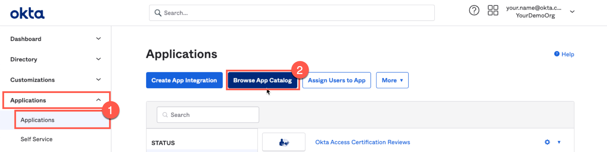

2.  Navigate to **Applications \> Applications**.

3.  Click **Browse App Catalog** to open the Okta Integration Network

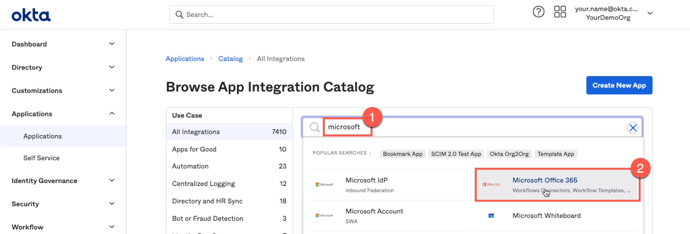

4.  Search for and select the **Microsoft Office 365** integration.

5.  Click **Add integration**.\

6.  Complete the *Microsoft Tenant Name* field. This must match the
    > tenant name you chose when setting up your Microsoft tenant. If
    > your Microsoft tenant is *yourdemodomain*.onmicrosoft.com then
    > your Microsoft tenant name is *yourdemodomain*.

7.  Click **Next**.

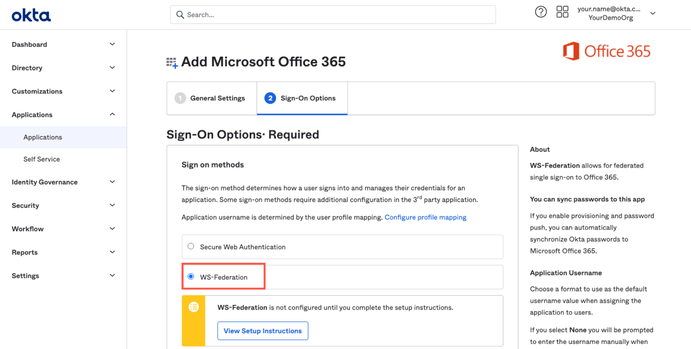

8.  Select the radio button for **WS-Federation**.

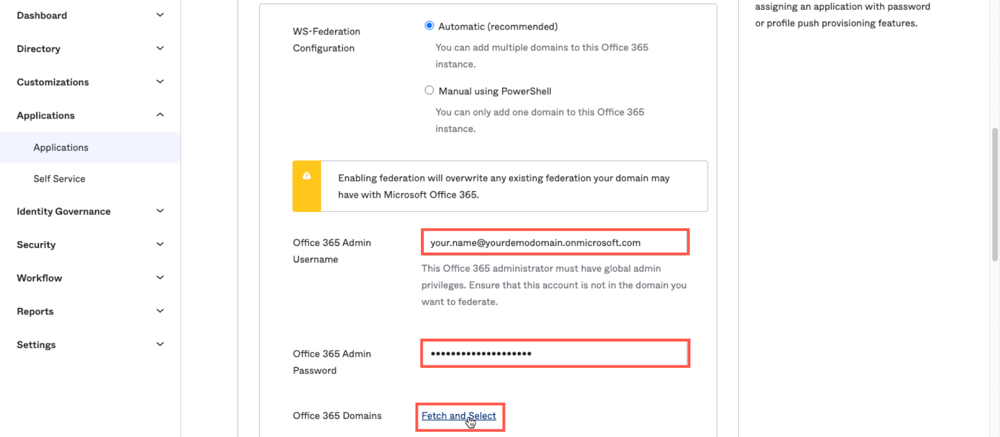

9.  Enter the *username* and *password* for the administrator of your
    > Microsoft tenant.

10. Click **Fetch and Select** next to Office 365 Domains.

11. Select the custom DNS domain that you configured when you were

> If no DNS domains are shown here, refer to these instructions: [[Get
> Microsoft E5
> sandbox]{.underline}](https://docs.google.com/document/d/1qvjRcUefXQyfwOSJ0duK35ZdFX5HBgddsAguscZSpyo/minimalstatic#heading=h.q5u9bvuz3rr2)

12. Click **Select**.

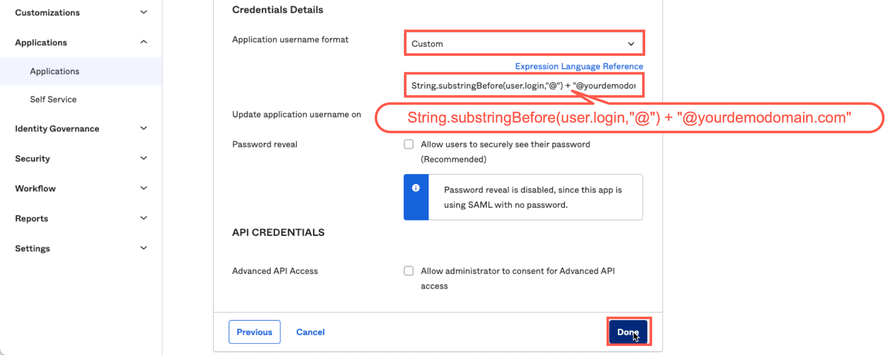

13. Set *Application username format* to **Custom**.

14. Enter the following for the expression - replacing

> **String.substringBefore(user.login,\"@\") + \"@yourdemodomain.com\"**

15. Click **Done**.\

Your Okta org, and your Microsoft 365 tenant, are now configured for
single sign-on from Okta to Azure AD.

Note: You can't test single sign-on until you have enabled provisioning
and assigned at least one user to this application in Okta.

# Configure provisioning

The single sign-on configuration performed in the previous section
allows your Okta org to assert identity information to your Microsoft
365 tenant and it allows your Microsoft 365 tenant to trust it. However
that's not enough for single sign-on to complete. Each identity asserted
by Okta must link to an existing account in Azure AD.

The required Azure AD accounts could be created manually, or synced from
a common identity source such as an on-premises AD but, in this case,
you will set up provisioning in Okta so that it can automatically manage
accounts in Azure AD. It will create accounts when users are assigned to
the Office 365 application and deactivate these accounts when users are
unassigned. It will also manage user attributes and licenses.

## Enable integration

Accounts in Azure AD can be managed via Microsoft APIs. To enable
provisioning, Okta must be granted authority to call these APIs. Follow
the steps below to grant this access and enable integration:

1.  If you are not already there, open your Okta administration UI,
    > navigate to **Applications \> Applications**, and select the
    > **Microsoft Office 365** application definition.

2.  Click on the **Provisioning** tab and click the **Configure API

3.  Check the checkbox for **Enable API integration**.

4.  Click the **Authenticate with Microsoft Office 365** button.

5.  Authenticate as the administrative user for your Microsoft tenant.\

6.  Click **Accept** to allow your Okta org to manage users in your

7.  Click **Save**.

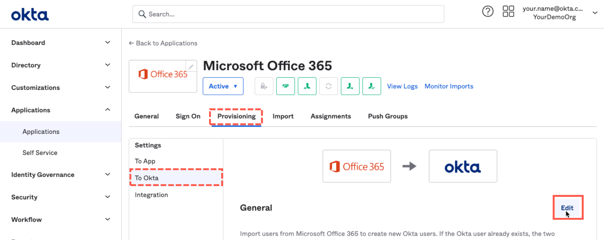

The API connection for provisioning is now in place. Provisioning
configuration is now shown under the Provisioning tab. The integration
configuration you just created is under the Integration tab.

There are two provisioning directions supported by this integration:

## Enable provisioning to app

In this section you will enable provisioning to Microsoft 365. This will
include creation of accounts in Azure AD when users are assigned to the
application, updating attributes in Azure AD when things change in Okta,
and deactivating accounts in Azure AD when users are unassigned from the
application in Okta.

Note: In general, Okta does not delete accounts from applications - it
only deactivates them. This ensures that Okta is not responsible for any
data loss in the backend system that could be triggered by deleting an
account.

Follow these steps to enable provisioning:

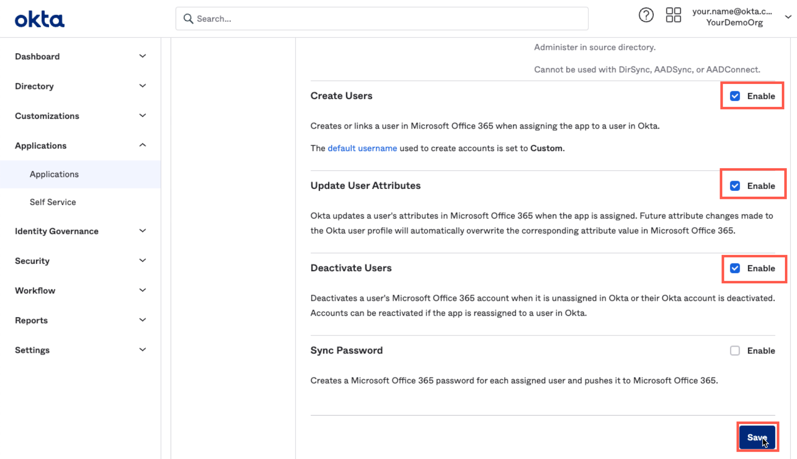

1.  Click **Edit** to set the options for Okta provisioning to Azure AD.

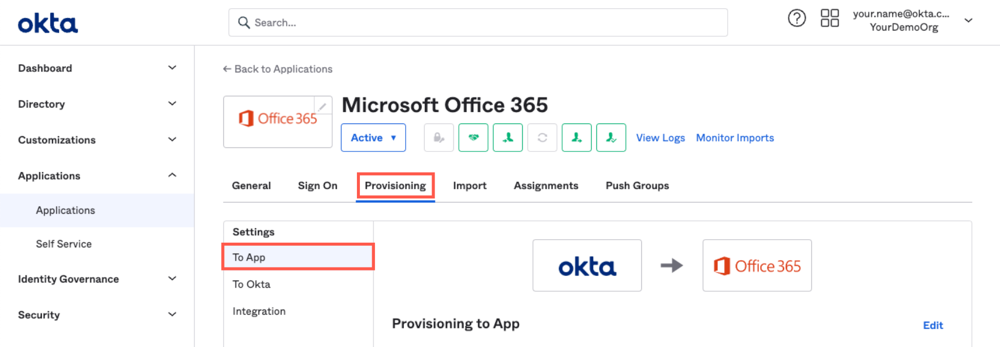

2.  Click the **Enable** checkbox for *Create Users*.

3.  Click the **Enable** checkbox for *Update User Attributes*.

4.  Click the **Enable** checkbox for *Deactivate Users*.

5.  Click **Save**.

## Configure attribute mapping

When a user is assigned to an application, attribute mapping determines
the default values that will be set for attributes in the application.
If attribute mapping is not configured, values for attributes must be
manually set whenever a user is assigned.

For Microsoft 365, the licenses and roles to be assigned to users can be
set up in attribute mapping. This is what you will configure here.
Follow these steps:

1.  If not already there, open the **To App** settings under the

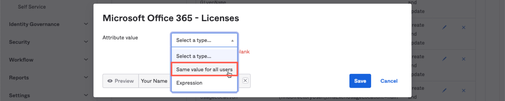

2.  Scroll to the bottom of the page and click **Show Unmapped

3.  Click the **Edit** icon for the *Licenses* attribute.

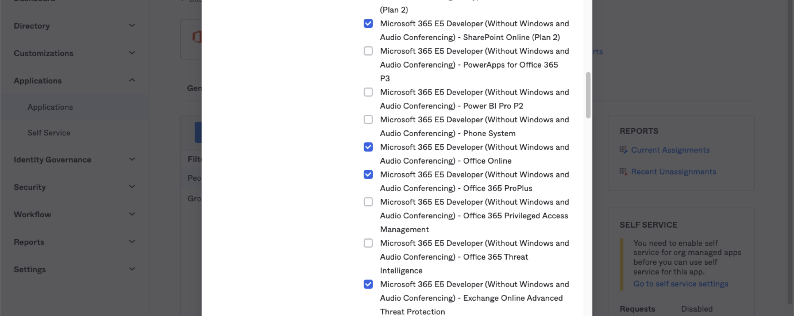

4.  Select **Same value for all users** from the drop-down list.\
    > The available options are shown. These have been pulled via API
    > and so reflect the options relevant for your Microsoft tenant:

>

5.  Select the checkboxes for the following licenses:

    -   Nucleus

    -   Content_Explorer

    -   Microsoft_Search

    -   Sharepoint Online (Plan 2)

    -   Office Online

    -   Office 365 ProPlus

    -   Exchange Online Advanced Threat Protection

-   Microsoft Teams

-   Intune

-   Exchange Online (Plan 2)

>
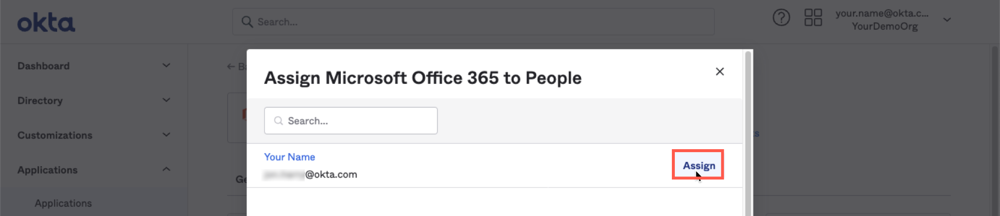

6.  Scroll to the bottom of the window and click **Save**.

OK. Provisioning is enabled and attribute mapping is done. You're ready
to test.

# Test provisioning and single sign-on

Now that provisioning and single sign-on have both been configured, you
can test them by assigning your Okta admin user to the Microsoft Office
365 application and then attempting single sign-on.

This section uses the Okta admin user ***your.name*\@okta.com** as the
test user. This user will be mapped to
***your.name*\@yourdemodomain.com** by the custom username mapping you
set up when configuring single sign-on.

## Assign user to Microsoft Office 365 application

For this test you will directly assign your Okta admin user to the
Office 365 application. You'll notice that it's also possible to assign
via group membership - you'll set that up later.

1.  If not already there, navigate to **Applications \> Applications**

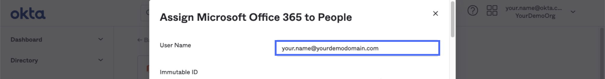

2.  Select the **Assignments** tab.

3.  Click the **Assign** button and select **Assign to People** from the

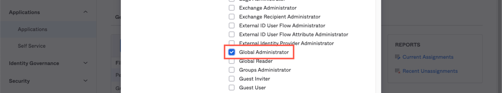

4.  Select your admin user and click **Assign**.

>
> The User Name has been set based on the custom expression you
> specified during configuration of single sign-on.
>
> The *Immutable ID* is blank. This would only be populated if the user
> was AD sourced and already had an immutable ID synced from Azure AD
> via Microsoft AD Connect or similar. In this case, the immutable ID
> will be populated during provisioning to Azure AD.
>
> Licenses have been set based on the attribute mapping you created.
>
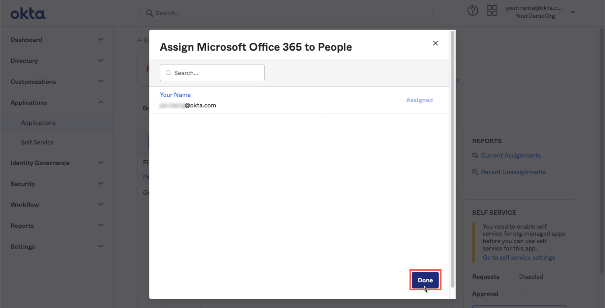

5.  Scroll down to the *roles* and select the **Global Administrator**

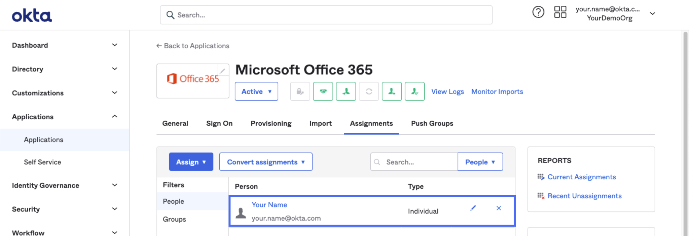

6.  Scroll to the bottom and click **Save and Go Back**.

7.  Click **Done**.

>
> In the background, Okta is now attempting to create this user in your
> Microsoft 365 tenant and assign the selected roles licenses. This
> should only take a few seconds to complete.
>

8.  In the Okta Admin UI, navigate to **Reports \> System Log**.

9.  Confirm that the records indicating successful provisioning are
    > found.

## Test single sign-on (SSO)

You can now test single sign-on to Microsoft 365 for the assigned user.

1.  Open a new browser window that is not signed into Okta or Microsoft

2.  Navigate to your Okta tenant. e.g. ***yourdemoorg*.okta.com**

3.  Authenticate as your test user: e.g. ***your.name*\@okta.com**\

4.  Click the tile for **Microsoft Office 365 Office Portal**.

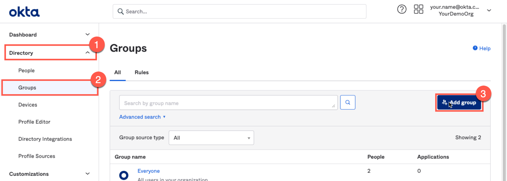

5.  Click **Yes** to stay signed in.

6.  Click the identity icon in the top-right of the page.

7.  Click **Sign out** to clear the session. Close the browser you used

# Configure group assignment

In the previous section, you assigned a user directly to the Microsoft
365 application. It was useful to do this so that you could assign the
Global Administrator role. However, for assigning users in bulk, it's
more usual to assign a group to an application and then assign users to
the group.

When assigning a group to an application, you can specify values for
application attributes. These will override any mapping for those
attributes in the application definition. If you don't specify any value
for an attribute, the mapping in the application definition will be
applied instead.

## Create a group

You will now create a group that will be assigned to the Microsoft
Office 365 application.

1.  In the administration UI for your Okta org, navigate to **Directory
    > \> Groups**.

2.  Click the **Add group** button.

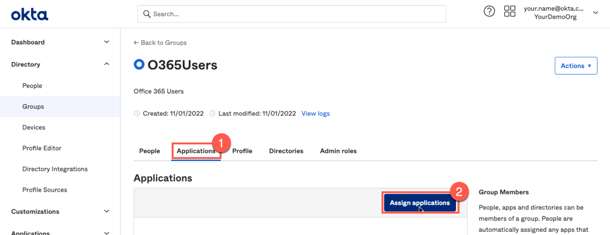

3.  Enter **O365Users** as the Name of the group.

4.  Enter **Office 365 Users** as the Description.

5.  Click **Save**.

## Assign group to application

You can assign a group to an application by either assigning the group
within the application definition or by adding the application to the
group definition. In this case you will add the application from the
group definition.

1.  If not already there, navigate to **Directory \> Groups**.

2.  Click on the link for the **O365Users** group.

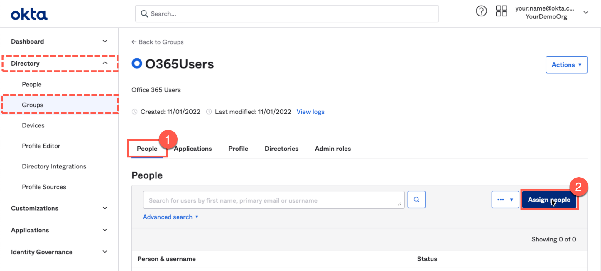

3.  Select the **Applications** tab in the group properties.

4.  Click **Assign applications**.

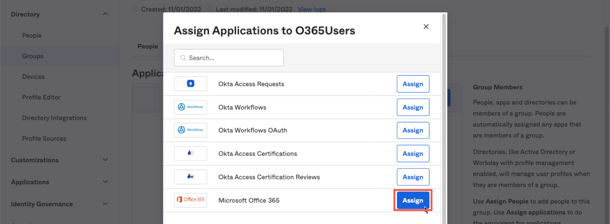

5.  Click the **Assign** button next to the *Microsoft Office 365*

6.  Scroll to the bottom of the page and click **Save and Go Back**.

7.  Click **Done**.

## Assign user to group

You will now assign a test user to the *O365Users* group. This will
cause the user to be assigned the Microsoft Office 365 application
which, in turn, will trigger provisioning of an account.

1.  If not already there, navigate to **Directory \> Groups**.

2.  Select the **People** tab.

3.  Click **Assign people**.

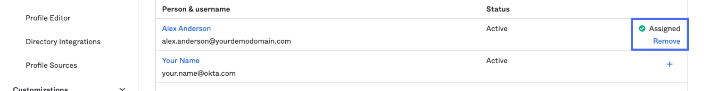

4.  Click the **+ icon** for a test user in your Okta org.\

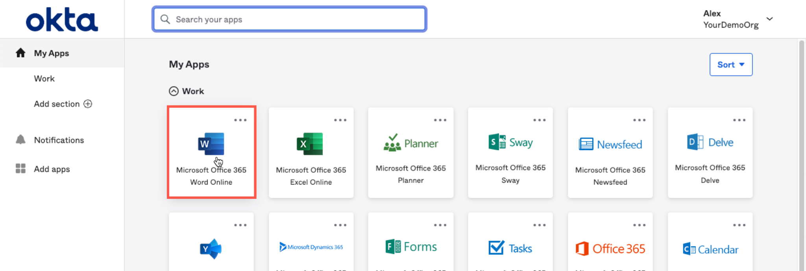

The user is now assigned to the group and will be assigned to the
Microsoft Office 365 application using the attribute mapping associated
with the group assignment.

## Test single sign-on

You can now test single sign-on to Microsoft 365 for your test user.

1.  Open a new browser window that is not signed into Okta or Microsoft

2.  Navigate to your Okta tenant. e.g. ***yourdemoorg*.okta.com**

3.  Authenticate as your test user: e.g.
    > ***alex.anderson@yourdemodomain.com***\

4.  Click the tile for **Microsoft Office 365 Word Online**.

5.  Click **Yes** to stay signed in.

6.  Click the identity icon in the top-right of the page.

7.  Click **Sign out** to clear the session. Close the browser you used

Congratulations! You have successfully configured Lifecycle Management
and Single Sign-On to Microsoft Office 365. Your demo environment can
now be used to demonstrate these capabilities to customers.

